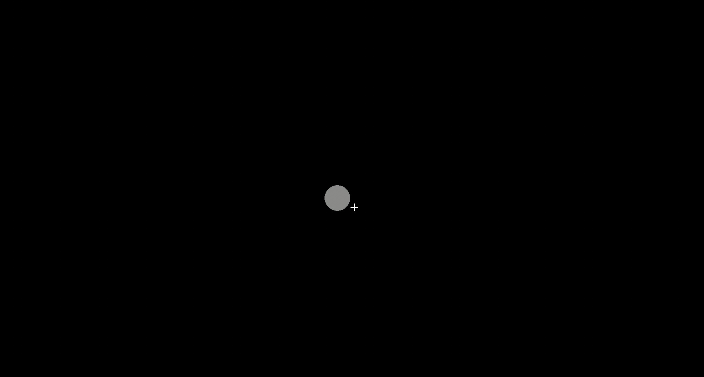
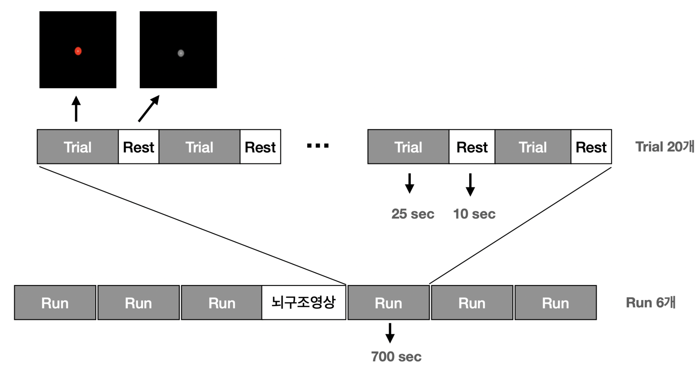
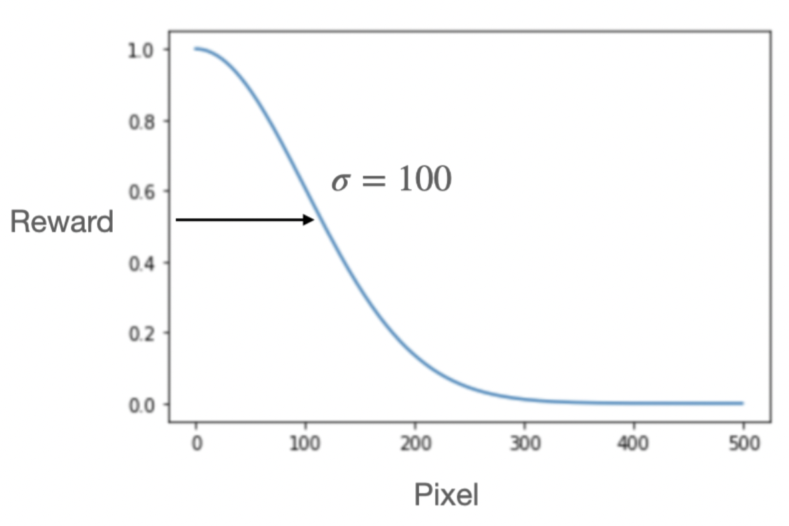

# 논문 제목 : 인간 운동 제어의 과제 중심 심층 강화 학습 모델을 이용한 fMRI 연구

## 연구 배경
 

1. 인공지능의 유래는 뇌 과학이며, 핵심 알고리즘은(i.e, Convolutional Neural Network, Long Short Term Memory, etc..) 인간의 뇌로부터 영감을 받아 고안되었다.
 

2. 기존 뇌과학 연구는 해석의 용이성을 위해 단순한 연구를 진행하였으나, 이는 실제 환경과 차이가 존재했다. 따라서, 보다 실제환경에 가까운 복잡한 연구를 진행하기 시작했고, 이 연구를 위해 **딥러닝 모델**을 적용하기 시작했다.
 

## 연구 개요 및 목적
 

1. 최근 논문에(Cross et al.,2021) 따르면, end-to-end 방식으로 학습된 Deep Q Network 모델의 파라미터가 인간의 뇌 활동을 일부 설명함을 보였다.하지만, 이 논문은 의사결정 분야에 관한 논문으로 연속적인 행동이 아닌 버튼을 클릭하는 **이산적인 행동방식**으로 실험을 진행하였다.
 

3. 본 프로젝트는 연속적인 운동학습이 심층 강화학습 (Deep Reinforcement Learning; DRL)에 의해 설명될 수 있는지 알아보고자 연구를 진행하였다.
 

> "Cross et al.,2021" 과의 차이점 
> - 의사결정이 아닌 연속적인 운동학습을 연구하였다.
> - "Cross et al.,2021"과는 달리 사람의 Action Policy와 DRL 모델의 Action Policy간 상관관계를 이용하여 그 근거를 찾고자 하였다.
 

## fMRI 실험

### 1. 실험 개요

- 본 프로젝트는 사람의 뇌 데이터와 강화학습 모델의 출력 간 상관관계를 구하는 것이다. 이 과정은 사람의 뇌 데이터를 수집하기 위해 진행하였다.
 

### 2. 실험 환경
 

- 본 실험의 목적은 게임을 수행하는 도중, 사람 피험자의 뇌 데이터를 fMRI 장비를 이용하여 수집하는 것이다.

- 이를 위해, 성균관대학교 CNIR의 3T MRI 장비를 이용하였다.

### 3. fMRI specification

| Specification   | Value                 |
|-----------------|-----------------------|
| voxel size      | 2.68 x 2.68 x 2.68 mm |
| TE              | 27 ms                 |
| TR              | 500 ms                |
| FoV             | 216 mm                |
| slice thickness | 2.7 mm                |

### 4. 실험 상세
 

- 타겟의 모양은 동그라미이고, 커서는 십자가 모양이다.
- 커서가 타겟의 범위 내에 들어가면, 타겟의 색은 회색에서 빨간색으로 변경된다.
- 실험은 아래와 같이, 6개의 run으로 구성되고, 각 run은 20개의 trial을 가진다.
  

  

## 강화학습 모델

### 1. 실험 개요

- 본 프로젝트는 사람의 뇌 데이터와 강화학습 모델의 출력 간 상관관계를 구하는 것이다. 이 과정은 강화학습을 사람과 동일한 실험에 대해 학습시키고, 출력 값을 추출하기 위해 진행하였다.
 

### 2. 게임 환경 구성
 

- State : state는 [커서의 x좌표, 커서의 y좌표, 타겟의 x좌표, 타겟의 y좌표] 4차원 벡터로 정의 하였다.

- action : 극 좌표계인 2차원 벡터 $r$, $\theta$로 구성하였고, 행동의 범위는 $0 < r < 1$,$-1 < \theta < 1$ 이다.

- reward : 타겟과 커서 간의 유클리디안 거리를 가우시안 함수의 입력으로 사용하여 얻은 출력 값으로 정의하였다. 이 보상의 범위는 $0 < reward < 1$ 이다. 정규 분포 함수의 파라미터인 $\sigma = 100$ 으로 설정하였다.

### 3. 입력 데이터 전처리

- 사람이 어떤 시각적인 정보를 볼 때 모든 영역을 동일한 가치를 두는 것이 아닌 핵심적인 정보를 담고 있는 영역에 더욱 가치를 둔다는 attention에서 영감을 얻어 이미지 Cropping을 진행하였다. (1920 x 1080 이미지를 84 x 84로 Cropping)

### 4. 강화학습 모델 구조

### 5. 강화학습 모델 결과

- 다양한 입력을 이용하여 실험한 결과, 4프레임을 한번의 입력으로 사용할 때 행동정책이 사람과 가장 유사했다.

  

