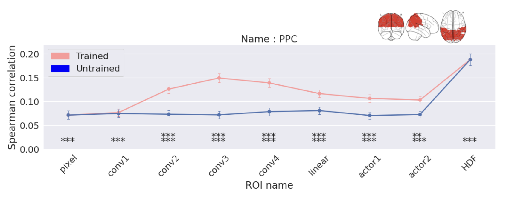

# 논문 제목 : 인간 운동 제어의 과제 중심 심층 강화 학습 모델을 이용한 fMRI 연구

## 연구 배경

1. 인공지능의 유래는 뇌 과학이며, 핵심 알고리즘은(i.e, Convolutional Neural Network, Long Short Term Memory, etc..) 인간의 뇌로부터 영감을 받아 고안되었다.

2. 기존 뇌과학 연구는 해석의 용이성을 위해 단순한 연구를 진행하였으나, 이는 실제 환경과 차이가 존재했다. 따라서, 보다 실제환경에 가까운 복잡한 연구를 진행하기 시작했고, 이 연구를 위해 **딥러닝 모델**을 적용하기 시작했다.
 

## 연구 개요 및 목적

1. 본 프로젝트는 연속적인 운동학습이 심층 강화학습 (Deep Reinforcement Learning; DRL)에 의해 설명될 수 있는지 알아보고자 연구를 진행하였다.

2. 이를 위해, 사람은 간단한 실험을 fMRI 내에서 진행하고, 강화학습은 동일한 실험을 학습한 후, 사람의 뇌 데이터와 강화학습 모델의 출력 간의 상관관계를 연구하였다.
 

## fMRI 실험

### 1. 실험 개요

: 본 프로젝트는 사람의 뇌 데이터와 강화학습 모델의 출력 간 상관관계를 구하는 것이다. 이 과정은 사람의 뇌 데이터를 수집하기 위해 진행하였다.

### 2. 실험 환경

: 본 실험의 목적은 게임을 수행하는 도중, 사람 피험자의 뇌 데이터를 fMRI 장비를 이용하여 수집하는 것이다.
: 이를 위해, 성균관대학교 CNIR의 3T MRI 장비를 이용하였다.

### 3. fMRI specification

| Specification   | Value                 |
|-----------------|-----------------------|
| voxel size      | 2.68 x 2.68 x 2.68 mm |
| TE              | 27 ms                 |
| TR              | 500 ms                |
| FoV             | 216 mm                |
| slice thickness | 2.7 mm                |

### 4. 실험 상세

#### 타겟의 모양은 동그라미이고, 커서는 십자가 모양
#### 커서가 타겟의 범위 내에 들어가면, 타겟의 색은 회색에서 빨간색으로 변경

#### 실험은 아래와 같이, 6개의 run으로 구성되고, 각 run은 20개의 trial을 가진다.

 

## 강화학습 모델

### 1. 실험 개요

: 본 프로젝트는 사람의 뇌 데이터와 강화학습 모델의 출력 간 상관관계를 구하는 것이다. 이 과정은 강화학습을 사람과 동일한 실험에 대해 학습시키고, 출력 값을 추출하기 위해 진행하였다.

### 2. 게임 환경 구성

#### State
 : state는 [커서의 x좌표, 커서의 y좌표, 타겟의 x좌표, 타겟의 y좌표] 4차원 벡터로 정의 하였다.

#### action
 : 극 좌표계인 2차원 벡터 $r$, $\theta$로 구성하였고, 행동의 범위는 $0 < r < 1, -1 < \theta < 1$ 이다.

#### reward
 : 타겟과 커서 간의 유클리디안 거리를 가우시안 함수의 입력으로 사용하여 얻은 출력 값으로 정의하였다. 이 보상의 범위는 $0 < reward < 1$ 이다. 정규 분포 함수의 파라미터인 $\sigma = 100$ 으로 설정하였다.

### 3. 입력 데이터 전처리

: 사람이 어떤 시각적인 정보를 볼 때 모든 영역을 동일한 가치를 두는 것이 아닌 핵심적인 정보를 담고 있는 영역에 더욱 가치를 둔다는 attention에서 영감을 얻어 이미지 Cropping을 진행하였다. (1920 x 1080 이미지를 84 x 84로 Cropping)

### 4. 강화학습 모델 구조

### 5. 강화학습 모델 결과

: 다양한 입력을 사용하여 실제 사람의 행동 정책과 비교하였을 때, 4 frame을 입력으로 하는 모델의 행동정책이 사람과 가장 유사했다. 

#### Action Policy Histogram, Correlation

<t> 

 

## 사람과 강화학습 비교

### 1. Voxelwise Encoding Model

1. 강화학습 모델의 각 레이어 출력 값들을 뇌 데이터에 맞게 다운 샘플링 및 차원 축소
2. 다운 샘플링 된 데이터로 뇌 데이터로 예측하는 ridge regression 모델 생성
3. 예측 값과 실제 뇌 데이터 간 상관관계를 구하여 이 상관관계를 시각화

#### 결과 : 학습된 모델을 입력으로한 회귀 모델의 예측 값이 사람이 행동을 할 때 활성화되는 영역과 상관관계가 높은 반면, 학습되지 않은 강화학습 모델은 그렇지 않았다.

#### 학습된 모델과 뇌 데이터 간의 상관관계

 

#### 학습된 모델과 뇌 데이터 간의 상관관계

### 2. 표현 유사 분석

#### 가설 : 강화학습 모델이 위계적인 처리과정을 보인다면, 초기 layer는 인간의 시각피질과, 중간 layer는 후두정엽 PPC와, 마지막 layer는 motor cortex와 상관관계가 높을 것이다.

#### 결과 : 위계적인 정보 처리 방식은 보이지 못하였으나, 학습된 모델이 그렇지 않은 모델보다 유의미한 차이로 뇌 데이터와 상관관계가 존재했다.

 

 

 